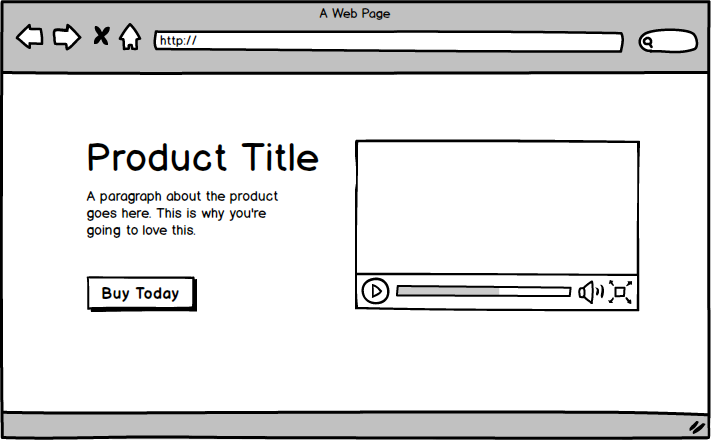

# Boogle

Create a new directory and repository with the following files:

```
/home-page.html
/product-details-page.html
/scrollable-column-page.html
/shared.css
```

then create pages based on the mockups below as best you can.


# Homepage


## Product Detail Page




## Scrollable Column Page


