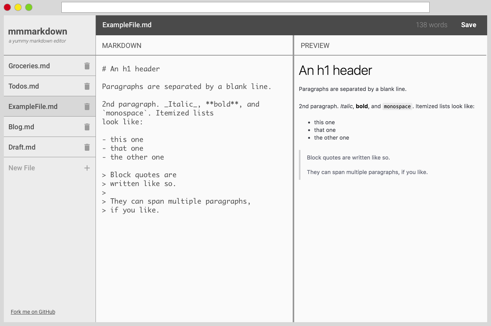

# Mmmarkdown

Create a new directory and repository with the following files:

```
/index.html
/styles.css
```

then build and style the page based on the mockup below as best you can.



You can find the trash can icon on the Material UI icon site: https://material.io/icons/.
