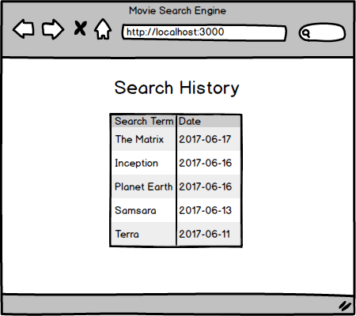

# Movie Search Engine

## Skills

- Can use AJAX to make HTTP requests from the browser
- Can convert a wireframe into HTML & CSS
- Can design and implement a SQL schema
- Can write JavaScript in the browser

## Exercise

Implement a full stack web application which helps you search for a movie using data scraped from IMDB.

The web app lets a user signup, login, and search for movies.

## User Stories
- As a user I should be able to sign up. The signup form should ask for my email and password, and should be redirected to the home page, after successfully creating my account
- As a user I should be able to log into the application, and should be redirected to the home page
- As a user if I access the home page without logging in, I should be redirected to the login page.
- As a logged in user I should be able to go the home page. The home page should contain a search form for the user to search for a movie title.
- As a user I should be able to search for a movie title. Clicking on the "search" button should trigger an AJAX request, and without refreshing the page, the search results should be displayed on the page.
- As a user, I should be able to look at my search history.

## Specs
- All user stories are completed
- `express` node package is used
- `pg-promise` node package is used
- The schema for the database exists in the file `schema.sql`

## Wireframes

Use the wireframes as inspiration for your design.

### Home Page

### Searching

### Search Results

### Search History

