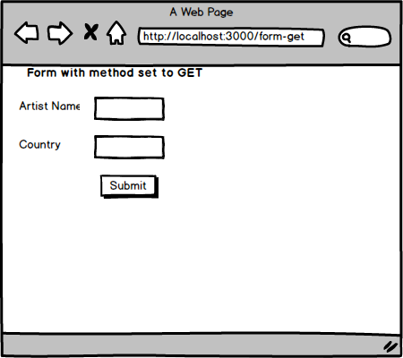

# Posting Data To The Server With A Form


## Skills

- Can create a form that does an HTTP `GET` request
- Can create a form that does an HTTP `POST` request
- Can describe the difference between HTTP query params and HTTP body params
- Can describe the difference between a relative and absolute HTTP URL path
- Can describe an HTTP redirect

## Search Terms

```
html forms
express form handling
html forms method get post
how to parse a body of a request express
```

## Suggested Resources

### Reading

- https://www.w3schools.com/html/html_forms.asp
- https://www.hacksparrow.com/form-handling-processing-in-express-js.html

### Watching

- https://www.youtube.com/watch?v=rin7gb9kdpk
- https://www.youtube.com/watch?v=vKlybue_yMQ


## Exercises

### Part 1

- Complete the following sections in the `Express Basics` course in [TeamTreeHouse](https://teamtreehouse.com/library/express-basics)
  - Using Templates with Express

### Part 2

Build a basic web app using Express which can send data to the server via a HTML `<form>` element. You will be required to create two simple pages on the app. The mockups are provided below

#### Form Get Page

The `action` property of the form should be set to `/submit-form`



#### Form Post Page

The `action` property of the form should be set to `/submit-form`


#### Server Routes

The server should have the following routes
1. A route to render the `/form-get` page
    - url: `/form-get`
    - http method: `GET`
    - response: renders the `<form>` with method set to `GET`, and `action` set to `/submit-form`.
1. A route to render the `/form-post` page
    - url: `/form-post`
    - http method: `GET`
    - response: renders the `<form>` with method set to `POST`,  and `action` set to `/submit-form`
1. A route which handles the form submissions
    - url: `/submit-form`
    - http method: `ANY`
    - response: returns a JSON response of the request's body params and the request's query params
    - example response: `{"body-params": {"artist": "bonobo", "country": "uk"}, "query-params": {}}`


